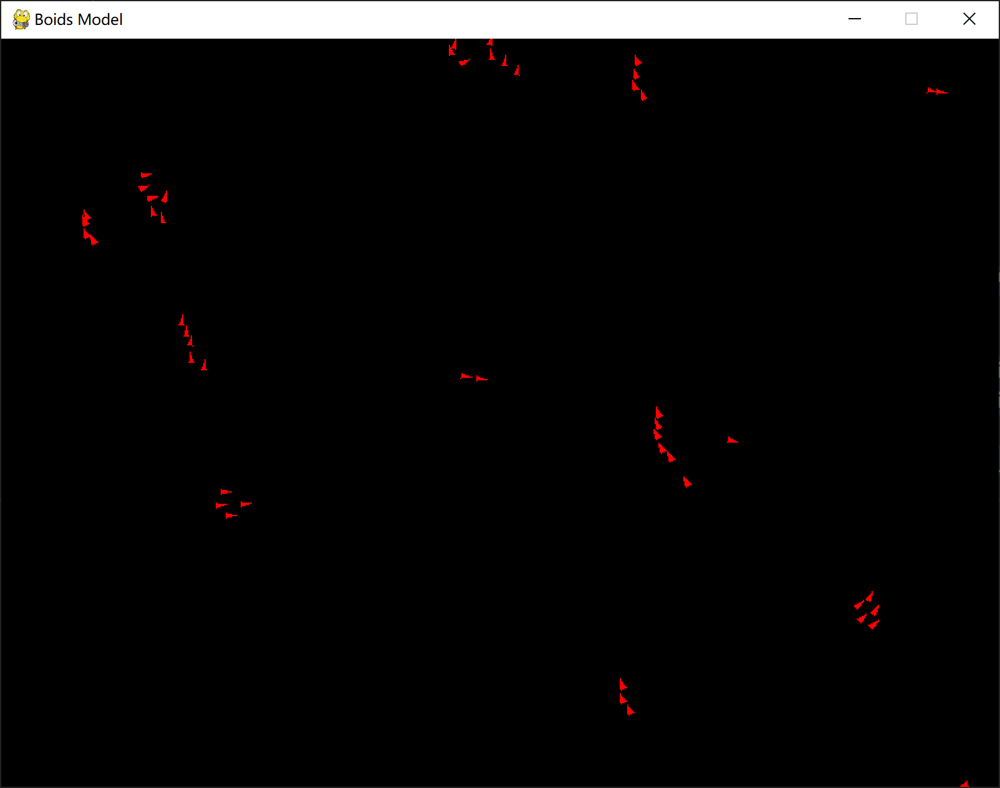
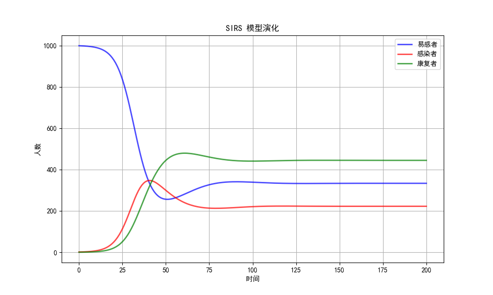

# 实验一

## 实验要求

1. 实现全局耦合网络，展示网络图，并计算平均路径长度和聚类系数。

2. 实现最近邻耦合网络，展示网络图，并计算平均路径长度和聚类系数。

3. 实现星形网络，展示网络图，并计算平均路径长度和聚类系数。

4. 实现随机网络，展示网络图，并计算平均路径长度和聚类系数。

## 全局耦合网络

在一个全局耦合网络中，每个节点与网络中的所有其他节点都直接相连。我们使用networkx创建了一个包含10个节点的全局耦合网络。代码如下：

```python
print("全局耦合网络")
    G = nx.complete_graph(10) # 创建一个包含10个节点的全局耦合网络
    print(f"平均路径长度: {nx.average_shortest_path_length(G)}")
    print(f"聚类系数: {nx.average_clustering(G)}")
    plot_network(G, title="全局耦合网络")
```

得到全局耦合网络的平均路径长度为1.0， 聚类系数为1.0。绘制全局耦合网络图的函数如下：

```python
def plot_network(G, title):
    pos = nx.spring_layout(G)
    plt.figure(figsize=(6, 6))
    nx.draw(G, pos, with_labels=True, node_color='skyblue', node_size=700, edge_color='gray') 
    manager = plt.get_current_fig_manager()
    manager.window.wm_title(title)
    plt.show()
```

绘制出的图像如下：


## 最近邻耦合网络

在一个最近邻耦合网络中，每个节点仅与k个最近邻节点相连，通常以环形连接。最近邻耦合网络的创建可以基于一个环形网络。首先创建一个包含20个节点的最近邻耦合网络，然后将每个节点与其相邻的4个节点相连，便完成了最近邻耦合网络的创建。在创建时，需要注意k必须是偶数，否则主动产生报错来提高程序鲁棒性。代码如下：

```python
def create_nearest_neighbor_coupled_network(n, k):
    """
    创建一个最近邻耦合网络，其中每个节点连接到其k个最近的邻居。
    
    参数:
    n - 节点数
    k - 每个节点连接的最近邻居数（必须是偶数）
    
    返回:
    G - 最近邻耦合网络
    """
    if k % 2 != 0:
        raise ValueError("k must be even")
    G = nx.cycle_graph(n)  # 创建一个包含n个节点的环状网络
    # 为每个节点添加k/2个最近邻居的边
    for i in range(1, k//2 + 1):
        edges_to_add = [(j, (j + i) % n) for j in range(n)]
        G.add_edges_from(edges_to_add)
    return G

print("最近邻耦合网络") # 创建一个包含20个节点的最近邻耦合网络，k=4
G = create_nearest_neighbor_coupled_network(20, 4)
print(f"平均路径长度: {nx.average_shortest_path_length(G)}")
print(f"聚类系数: {nx.average_clustering(G)}")
plot_network(G, title="最近邻耦合网络")
```

得到最近邻耦合网络的平均路径长度为1.895， 聚类系数为0.5。绘制最近邻耦合网络的图片如下：


## 星形网络

在星形网络中，一个中心节点与所有其他节点直接相连，而其他节点之间没有连接。我们使用networkx创建了一个包含10个节点的星形网络。代码如下：

```python
print("星形网络")
G = nx.star_graph(9) # 创建一个包含10个节点的星形网络
print(f"平均路径长度: {nx.average_shortest_path_length(G)}")
print(f"聚类系数: {nx.average_clustering(G)}")
plot_network(G, title="星形网络")
```

得到星形网络的平均路径长度为1.8， 聚类系数为0.0。绘制星形网络的图片如下：


## 随机网络

在一个ER随机网络中，网络中的每一对节点以固定概率随机连接。我们使用networkx创建了一个包含10个节点的随机网络，其中每一对节点以0.3的概率连接。代码如下：

```python
print("随机网络")
G = nx.erdos_renyi_graph(10, 0.3)
print(f"平均路径长度: {nx.average_shortest_path_length(G)}")
print(f"聚类系数: {nx.average_clustering(G)}")
plot_network(G, title="随机网络")
```

得到随机网络的平均路径长度为1.956， 聚类系数为0.227。绘制随机网络的图片如下：


## 总结
|名称|平均路径长度|聚类系数|
|:---:|:---:|:---:|
|全连接网络|1.0|1.0|
|最近邻耦合网络|2.895|0.5|
|星形网络|1.8|0.0|
|随机网络|1.956|0.227|

对上述数据进行可视化，可以得到：


# 实验二

## 实验要求

1. 实现并展示WS小世界模型构建，并计算平均路径长度和聚类系数。

2. 实现并展示NW小世界模型构建，并计算平均路径长度和聚类系数。

3. 实现并展示无标度网络模型构建，并计算平均路径长度和聚类系数。

## WS小世界模型
WS小世界模型是一种具有短平均路径长度和高聚类系数的网络模型，其特点是通过随机重连来实现小世界特性。我们使用networkx创建一个包含20个节点的WS小世界模型，初始连接的最近邻居数为4， 每条边有0.3的概率重连。代码如下：
```python
print("WS小世界模型")
G = nx.watts_strogatz_graph(20, 4, 0.1) # 创建一个包含20个节点的WS小世界模型
print(f"平均路径长度: {nx.average_shortest_path_length(G)}")
print(f"聚类系数: {nx.average_clustering(G)}")
plot_network(G, title="WS小世界模型")
```

我们创建的这个网络平均路径长度为2.616，聚类系数为0.4333。绘制网络图片如下：


## NW小世界模型
NW小世界模型是一种小世界网络模型的变体，其特点是通过添加新边而不是重新连接现有边来生成小世界特性。我们使用networkx创建一个包含20个节点的WS小世界模型，初始连接的最近邻居数为4， 每两个点之间有0.1的概率添加新边。代码如下：
```python
print("NW小世界模型")
G = nx.newman_watts_strogatz_graph(20, 4, 0.1) # 创建一个包含20个节点的NW小世界模型
print(f"平均路径长度: {nx.average_shortest_path_length(G)}")
print(f"聚类系数: {nx.average_clustering(G)}")
plot_network(G, title="NW小世界模型")
```

我们创建的NW小世界模型平均路径长度为2.5842，聚类系数为0.4967。绘制网络图片如下：


## 无标度网络模型
无标度网络模型的特点是具有一些节点具有非常高的连接度，而大多数节点的连接度较低，通常遵循幂律分布。我们使用networkx创建了一个包含20个节点，每个新节点添加2条边的无标度网络模型。
```python
print("无标度网络模型")
G = nx.barabasi_albert_graph(20, 2) # 创建一个包含20个节点的无标度世界模型
print(f"平均路径长度: {nx.average_shortest_path_length(G)}")
print(f"聚类系数: {nx.average_clustering(G)}")
plot_network(G, title="无标度网络模型")
```

我们创建的NW小世界模型平均路径长度为2.2473，聚类系数为0.090。绘制网络图片如下：


## 总结

|名称|平均路径长度|聚类系数|
|:---:|:---:|:---:|
|WS小世界模型|2.616|0.4333|
|NW小世界模型|2.5842|0.4967|
|无标度网络模型|2.2473|0.090|

对上述数据进行可视化，可以得到：


# 实验三

## 实验要求

5.2 实现线性阈值模型构建，并给出实例演示。

## 实验过程

线性阈值模型是一种描述社会影响和传播动态的模型，其中个体在受到足够多邻居的影响后会改变状态，从而触发连锁反应。

我们首先使用networkx.DiGraph函数创建一个单向图：

```python
G = nx.DiGraph()
```

接下来，在该单向图中添加每一个节点的权重和边的权重：

```python
# 添加节点
    nodes = [(1, {'weight': 0.6}), (2, {'weight': 0.5}), (3, {'weight': 0.7}), (4, {'weight': 0.9})]
    G.add_nodes_from(nodes)
    # 添加有向边并赋值属性
    edges = [(1, 2, {'weight': 0.5}),
             (1, 3, {'weight': 0.5}),
             (2, 3, {'weight': 0.5}),
             (3, 2, {'weight': 0.5}),
             (2, 4, {'weight': 0.5}),
             (3, 4, {'weight': 0.5}),
            ]
```

打印初始网络状态，其中红色代表的是已经被激活的节点。


在传播的过程中，每一轮将遍历每一个未被激活的节点，查看其相邻节点内是否有已被激活的节点。当节点受到邻居的激活权重总和大于等于其激活阈值时，该节点被激活。持续更新直至一轮中没有新被激活的节点。传播过程实现代码如下：

```python
def linear_threshold_model(G, start):
    # Activated nodes
    activated = set(start)
    newly_activated = set(start)
    activation_history = [set(start)]
    node_labels = {node: data for node, data in G.nodes(data=True)}
    edge_labels = {(u, v): f"{data['weight']}" for u, v, data in G.edges(data=True)}
    i = 0
    while newly_activated:
        current_activated = set()
        for node in G.nodes():
            if node not in activated:
                s = 0
                for neighbor in G.nodes():
                    if node in G.neighbors(neighbor) and neighbor in activated:
                        s += G[neighbor][node]['weight']
                if s >= node_labels[node]['weight']:
                    current_activated.add(node)
        
        newly_activated = current_activated
        if newly_activated:
            activated.update(newly_activated)
            activation_history.append(newly_activated)
            i += 1
            plot_network(G, activated, f"第{i}次传播")
    return activation_history
```


在该实验中，我们的传播总共进行了3轮。第一次传播中，a2节点被激活：


第二次传播中，a3节点被激活：


第三次传播中，a4节点被激活：


# 实验四

## 实验要求

6.1 实现Boids模型，并给出实例演示。

## 实验过程

Boids模型是一种用于模拟群体行为的计算模型，由克雷格·雷诺兹（Craig Reynolds）在1986年提出。该模型通过简单的规则模拟出鸟群、鱼群等群体的复杂行为。Boids模型中的每个个体决策都遵循三个基本规则：避免碰撞、方向统一和群体聚合。

我们将使用三角形来表示物体的位置和方向。三角形的形状定义如下：


可以计算得到三角形的三个顶点坐标如下：

$$x1 = x+2\cos{\theta}\quad y1=y+2\sin{\theta}$$
$$x2 = x+0.5\sin{\theta}\quad y2 = y-0.5\cos{\theta}$$
$$x3 = x-0.5\sin{\theta}\quad y3=y+\cos{\theta}$$

首先我们创建Boid类来代表一个个体。

```python
class Boid:
    def __init__(self):
        self.size = 4
        self.x = random.randint(0, WIDTH)
        self.y = random.randint(0, HEIGHT)
        self.angle = random.uniform(0, math.pi * 2)
        self.speed = 3
        self.point_list = [(self.x+self.size*2*math.cos(self.angle), self.y+self.size*2*math.sin(self.angle)), (self.x+self.size*0.5*math.sin(self.angle), self.y-self.size*0.5*math.cos(self.angle)), (self.x-self.size*0.5*math.sin(self.angle), self.y+self.size*0.5*math.cos(self.angle)) ]

    # 更新位置
    def update(self, flock):
        self.rule3(flock)
        self.rule1(flock)
        self.rule2(flock)
        self.move()
```

类鸟检测某个范围内（与分离规则的范围不同）的所有类鸟的位置，计算出质心，然后产生一个指向质心的速度。我们设置群聚的检测范围为40。群聚行为的实现如下：

```python
    def rule1(self, flock):
        alpha = 0.9
        gathering = 40
        move_x, move_y = 0, 0
        l = 0
        for boid in flock:
            if boid != self:
                dist = math.sqrt((self.x - boid.x)**2 + (self.y - boid.y)**2)
                if dist < gathering:
                    l+=1
                    move_x += (gathering-dist)*(boid.x - self.x)/gathering
                    move_y += (gathering-dist)*(boid.y - self.y)/gathering
        if l!=0:
            self.angle = alpha * self.angle + (1-alpha)*math.atan2(move_y, move_x)
```

类鸟检测某个范围内的所有类鸟的速度，计算出平均速度，然后产生一个与平均速度方向一致的速度。我们设置方向统一的检测范围为40。方向统一的实现如下：

```python
    def rule3(self, flock):
        alpha = 0.9
        average= 40
        move_angle = 0
        l = 0
        for boid in flock:
            if boid != self:
                dist = math.sqrt((self.x - boid.x)**2 + (self.y - boid.y)**2)
                if dist < average:
                    move_angle += boid.angle
                    l += 1
        if l == 0:
            pass
        else:
            move_angle /=l
            self.angle = alpha * self.angle + (1-alpha)*move_angle
```

类鸟检测某个范围内的所有类鸟的位置，计算出质心，然后产生一个远离质心的速度。我们设置避免碰撞的检测范围为10，而相对地，避免碰撞对结果的影响更大。避免碰撞的实现如下：

```python
    def rule2(self, flock):
        alpha = 0.8
        separation= 10
        move_x, move_y = 0, 0
        l = 0
        for boid in flock:
            if boid != self:
                dist = math.sqrt((self.x - boid.x)**2 + (self.y - boid.y)**2)
                if dist < separation:
                    l += 1
                    move_x += (separation-dist)*(boid.x - self.x)/separation
                    move_y += (separation-dist)*(boid.y - self.y)/separation
        if l != 0:
            self.angle = (alpha * self.angle - (1-alpha)*(math.atan2(move_y, move_x)+0.5*math.pi))

```

可以注意到的是，我们的三个规则实现并不是简单地计算方向，而是考虑到了类鸟原有的方向惯性，将规则计算得到的方向以加权平均的方式对类鸟的方向做修正。在运行一段时间后，我们可以看到这样的群集运动：



# 实验五

## 实验要求

实现一种传染病模型，并给出实例演示。

## 实验过程

在SIRS模型中，人群被分为三类：易感者 (S)，感染者 (I)，以及康复者 (R)。同时，康复者也可以重新变为易感者。模型的演化由一组微分方程描述：

$$\frac{dS}{dt}=-\beta\frac{SI}{N}+\gamma R$$
$$\frac{dI}{dt} = \beta\frac{SI}{N}-\alpha I $$
$$\frac{dR}{dt} = \alpha I -\gamma R $$

我们定义模型参数和初始状态如下：

```python
# 定义模型参数
N = 1000   # 总人口数量
alpha = 0.1 # 康复率
beta = 0.3 # 传播率
gamma = 0.05 # 再感染率

# 初始状态：假设只有一个感染者，其他人都是易感者
I0 = 1
S0 = N - I0
R0 = 0
```

创建函数求解某一时刻的S，I，R的微分：

```python
def sirs_model(y, t, beta, alpha, gamma, N):
    S, I, R = y
    dSdt = -beta * S * I / N + gamma * R
    dIdt = beta * S * I / N - alpha * I
    dRdt = alpha * I - gamma * R
    return [dSdt, dIdt, dRdt]
```

借助python自带的常微分方程求解方法：

```python
solution = odeint(sirs_model, [S0, I0, R0], t, args=(beta, alpha, gamma, N))
S, I, R = solution.T
```

得到传播过程个类型的人群数量变化如下：



最终，S类型人数为333人，I类型人数为222人，R类型人群为444人。

